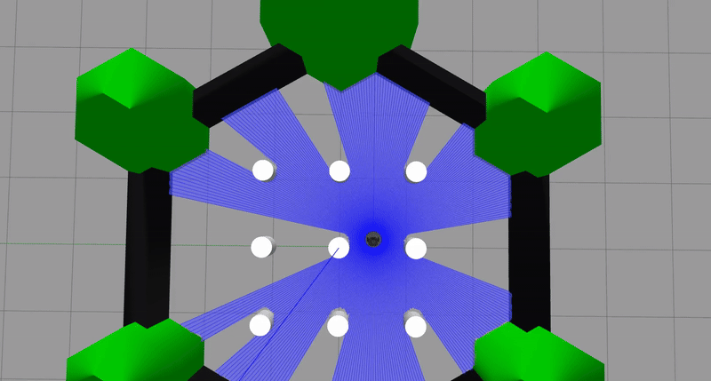

# ROS2 "Bump and Go" Demo

This project is part of one of the exercises of the [ACM SIGSOFT Summer School for Software Engineering](https://scivenia.com/en/event/acm-sigsoft-summer-school-for-software-engineering-in-robotic) for Robotics that took place in June 2025 at TU Delft. [Prof. Dr. Jose Miguel Guerrero](https://github.com/jmguerreroh) presented it. 

The project provides a simple demonstration of a reactive navigation algorithm known as "Bump and Go." It shows a simulated [TurtleBot3](https://www.turtlebot.com/turtlebot3/) robot in a TurtleBot3 world, controlled by a ROS2 node written in Python. The robot uses its LIDAR sensor to detect obstacles and changes its direction when it gets too close.



## Features

- **Algorithm:** Simple "Bump and Go" logic.
- **Robot:** TurtleBot3 Burger.
- **Environment:** TurtleBot3 world.
- **Framework:** ROS2 Humble.
- **Simulator:** Gazebo.
- **Visualization:** RViz2.

---

## Prerequisites

To run this project, you only need a Linux system (Ubuntu 22.04 is recommended) with **Docker** installed.

**Install Docker Engine:**
    Follow the official installation guide for your operating system.
    - [Docker installation instructions for Ubuntu](https://docs.docker.com/engine/install/ubuntu/)

---

## How to Run the Demo

The process is very straightforward and consists of 3 steps.

### 1. Clone the Repository

Open a terminal and clone this project to your local machine.

```bash
git clone https://github.com/your-username/first-ROS2-project.git
cd first-ROS2-project
```

### 2. Build the Docker Image
From the root of the project directory, run the following command to build the container image
```bash
docker build -t bump-and-go-app .
```

### 3. Run the container:
```bash
docker run -it --rm \
    --gpus all \
    -e DISPLAY=$DISPLAY \
    -v /tmp/.X11-unix:/tmp/.X11-unix \
    bump-and-go-gui-app
```


